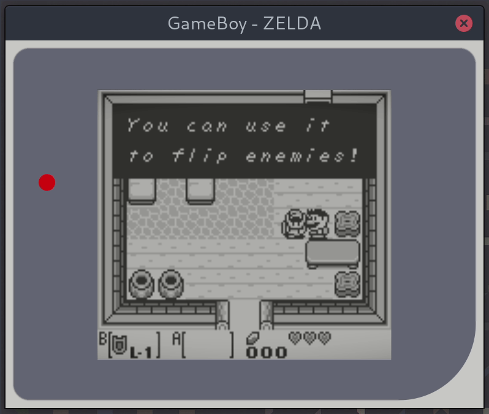

# GameBoy in Go using Fyne

A Fyne based interface using the gameboy.live emulator written by
AaronLiu (@HFO4).


## Running

To run simply execute the main.go file and pass a valid GameBoy rom filename.

Note that you must have Go modules enabled...

```
export GO111MODULE=on
go run main.go <romname.gb>
```

And you should see something like the following:



